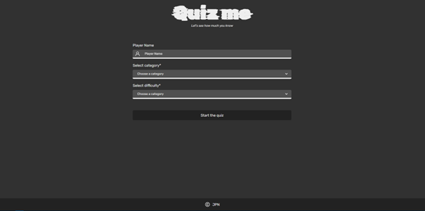
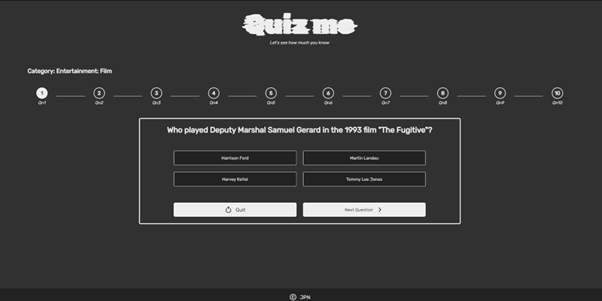

# Quiz Game App

    

    

## Description

A simple and interactive React based quiz game app that allows the user to test their knowledge on various topics by answering a series of multiple choice questions.
The app uses [axios](https://axios-http.com/docs/intro) to get the questions from the [Open Trivia DB](https://opentdb.com/api_config.php) database.The game aims to be engaging and fun while providing valuable learning opportunities.

## Features

- Multiple topics: the game covers a wide range of topics, making it suitable for different interests and knowledge levels
- Multiple choice: each question is presented in a multiple-choice format, providing four options to choose from
- Difficulty selection: the game allows the user to choose the difficulty of questions he wants to face, giving the opportunity for those who want to learn and providing some challange for those who are up for it
- Score tracking: keeps track of the users score and displays it after the game. During the game the user can see which questions were answered correctly, and which not
- Randomized questions: the app draws 10 random questions from a pool of questions, so that each round is different
- Responsive design for seamless gameplay on different devices.

## Live demo

You can try out the Quiz Game by visiting the [live demo](https://zack1808.github.io/quiz-game/).

## How to run the app locally

If you want to run the app localy:

#### 1. Clone the repository

- HTTPS: `git clone https://github.com/Zack1808/quiz-game.git`
- SSH: `git clone git@github.com:Zack1808/quiz-game.git`
- GitHub CLI: `gh repo clone Zack1808/quiz-game`

#### 2. Enter the project directory

`cd quiz-game`

#### 3. Allow the app to install the necessary packages (Node.js has to be installed on the device)

`npm install`

#### 4. Start the app

`npm start`

After execution, the localhost server will startup and a browser window will open, previewing the quiz game app.

## Topics

The Quiz Game has the following topics:

- Genral Knowledge
- Books
- Films
- Music
- Musicals and Theaters
- Television
- Video Games
- Board Games
- Science and Nature
- Computer
- Mathematics
- Mythology
- Sports
- Geography
- History
- Politics
- Art
- Celebrities
- Animals
- Vehicles
- Comics
- Gadgets
- Japaniese Anime

## Difficulty settings

The game also has 3 difficulty settings:

- Easy
- Normal
- Hard

## Contribution

Contributions to the Quiz Game project are welcome. If you want improve the user interface, or fix any issues, feel free to create a pull request. Make sure to follow the project's coding conventions and provide detailed information about your changes.

## Contact

If you have any questions or suggestions, you can reach me via:

- Mail: jeanpierrenovak23@gmail.com
- My portfolio: [jeanpierrenovak.netlify.app](https://jeanpierrenovak.netlify.app)

---

Have fun and enjoy expanding your knowledge with the Quiz Game!
